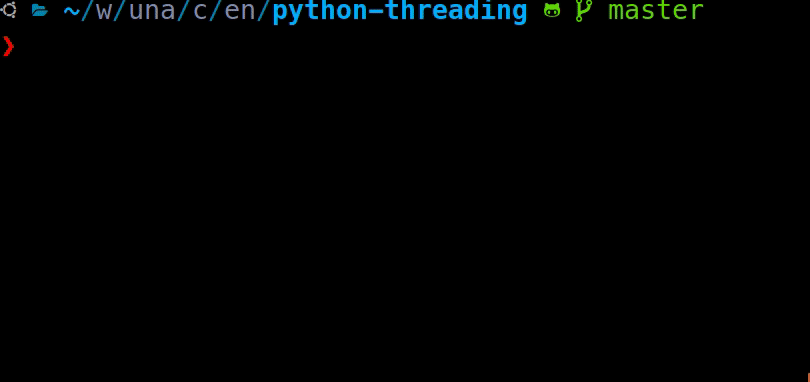

# Semaforos

## Ejercicio 1 - Computadoras e Impresoras
````
impresoras.py
````
En `impresoras.py` simula una serie de `Computadoras` que necesitan imprimir cosas en `Impresoras`.
El código implementa dos clases: *Impresora* y *Computadora*.
*Impresora* : tiene dos médodos, el constuctor, que recibe un número que idenfica a la impresora y el método *imprimir()* que recibe una cadena de texto y la imprime en pantalla.
*Computadora*: que deriva de threading Thread que tiene dos métodos, el constructor que recibe una cadena de texto y run() que implementa una thred que toma un objeto impresora desde una lista y llama al método *imprimir* de este objeto con el texto como argumento.
El hilo principal crea un lista con 3 objetos impresora y a continuacion arranca 5 hilos Computadora que van a intentar utilizar las impresoras disponibles.

Modificar el programa utilizando semáforos de modo que las computadoras se queden esperando si no hay impresoras disponibles. Como está ahora, arroja un error al intentar sacar un elemento cuando la lista está vacía. 


## Ejercicios 2 Comensales y Cocinero

````
comensales.py
`````

En `comensales.py` esta una simulación donde tenemos `Comensales`, un `Cocinero` y una determinada cantidad de platos disponibles.

La cantidad de platos disponibles se encuentra en una variable global iniciada en 3. 
Esta variable global debe decrementarse cada vez que un comensal "coma" (tome un plato).

El cocinero se mantiene **dormido** mientras haya platos disponibles.

Si un comensal quiere comer y no hay más platos (0), este deberá:
1. despertar al `Cocinero` para que los reponga;
1. esperar a que este termine (actualice la variable global de nuevo a 3);
1. comer (decrementando la variable global).

Nota: el cocinero debe volver a dormirse cuando termine de reponer los platos.

El código del archivo NO está completo, deberá agregar la sincronización necesaria para que el programa dado funcione como se describe mas arriba. 

No importa el orden en que comen los comensales, sí importa que no coman cuando no hay más platos. 

La salida debería verse más o menos así:

```
19:22:57.349 [Comensal 0] - ¡Qué rico! Quedan 2 platos
19:22:57.349 [Comensal 1] - ¡Qué rico! Quedan 1 platos
19:22:57.350 [Comensal 2] - ¡Qué rico! Quedan 0 platos
19:22:57.350 [Cocinero] - Reponiendo los platos...
19:22:57.350 [Comensal 4] - ¡Qué rico! Quedan 2 platos
19:22:57.350 [Comensal 3] - ¡Qué rico! Quedan 1 platos
```
### Comentario

No se puede asegurar que el thread que llamó al cocinero y se queda esperando, sea el primero en recibir un plato cuando el cocinero termina de cocinar. Esto es algo inherente a la concurrencia. Se puede leer de [acá](https://docs.python.org/3.8/library/threading.html#semaphore-objects) del `acquire()`.

## Ejercicios 3 Comensales y Cocinero
Modificar el ejercicio 2 de modo que haya más de un cocinero, compiten por quién cocina primero y solamente uno puede cocinar.

## Ejercicios 4 Comensales y Cocinero
Modificar el ejercicio 2 de modo que la cantidad de comensales que pueden pedir platos al mismo tiempo son 2.

## Ejercicios 5 - Vaquitas
````
vaquitas.py
`````
Vamos a simular que hay vacas yendo por un camino, todas para el mismo lado, y se topan con un puente.
Las vacas caminan a diferentes velocidades, y el puente no soporta el paso de más de una vaca a la vez.

Mirá la implementación que esta ahora, correla algunas veces, y familiarizate con el código.

Ahora agregale semáforos para asegurar que haya solamente una vaca cruzando el puente a la vez. La ejecución debería verse así:




